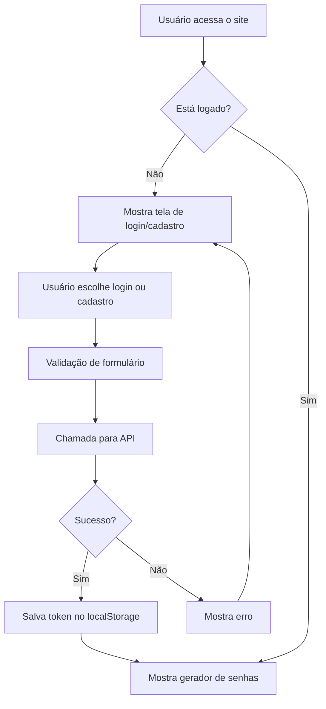

# Gerador de Senhas Seguras

Um gerador de senhas moderno e seguro com sistema de autenticação completo, desenvolvido com React, TypeScript e design clássico-moderno.

## 🚀 Funcionalidades

### Autenticação
- **Login e Cadastro** com validação em tempo real
- **Recuperação de senha** via email
- **Sessão persistente** com localStorage
- **Validação de formulários** robusta

### Gerador de Senhas
- **Personalização completa** de caracteres
- **Múltiplas senhas** simultâneas (até 20)
- **Comprimento configurável** (4-50 caracteres)
- **Cópia individual** ou em lote
- **Interface responsiva** e moderna

### Design
- **Estilo clássico-moderno** com gradientes suaves
- **Paleta de cores** profissional
- **Tipografia** otimizada (Inter + JetBrains Mono)
- **Animações** suaves e elegantes
- **Responsividade** completa

## 🛠️ Tecnologias

- **React 18** com TypeScript
- **Vite** para build e desenvolvimento
- **CSS Custom Properties** para theming
- **ESLint** para qualidade de código
- **Arquitetura modular** seguindo CGP

## 📁 Estrutura do Projeto

```
src/
├── components/          # Componentes React reutilizáveis
│   ├── LoginForm.tsx           # Formulário de login
│   ├── RegisterForm.tsx        # Formulário de cadastro
│   ├── ForgotPasswordForm.tsx  # Formulário de recuperação
│   └── PasswordGenerator.tsx   # Gerador de senhas principal
├── hooks/              # Hooks customizados
│   └── useAuth.ts              # Hook de autenticação
├── services/           # Serviços de API
│   ├── auth.service.ts         # Serviço de autenticação
│   └── email.service.ts        # Serviço de envio de emails
├── types/              # Definições TypeScript
│   └── auth.types.ts           # Tipos de autenticação
├── config/             # Configurações
│   └── api.config.ts           # Configuração da API
├── styles/             # Estilos globais
│   └── globals.css             # CSS com design system
├── pages/              # Páginas da aplicação
│   └── HomePage.tsx            # Página principal
└── main.tsx           # Ponto de entrada da aplicação
```

## 🏗️ Como o Código Funciona

### Arquitetura Geral
O projeto segue uma arquitetura modular baseada no **Contexto Global de Projetos (CGP)**:

1. **Separação de Responsabilidades**: Cada pasta tem uma função específica
2. **TypeScript**: Tipagem forte em todo o código
3. **React Hooks**: Gerenciamento de estado e lógica de negócio
4. **Serviços**: Comunicação com APIs externas
5. **Componentes**: Interface reutilizável e modular

### Fluxo de Autenticação



### Componentes Principais

#### 1. **HomePage.tsx** - Página Principal
- **Função**: Orquestra toda a aplicação
- **Responsabilidades**:
  - Gerenciar estado de autenticação
  - Alternar entre telas (login/cadastro/recuperação)
  - Mostrar gerador de senhas quando logado

#### 2. **useAuth.ts** - Hook de Autenticação
- **Função**: Centraliza toda lógica de autenticação
- **Responsabilidades**:
  - Gerenciar estado do usuário
  - Fazer chamadas para API
  - Persistir sessão no localStorage

#### 3. **auth.service.ts** - Serviço de API
- **Função**: Comunicação com backend
- **Responsabilidades**:
  - Login, cadastro, recuperação de senha
  - Gerenciar tokens JWT
  - Tratamento de erros

#### 4. **PasswordGenerator.tsx** - Gerador de Senhas
- **Função**: Interface principal do gerador
- **Responsabilidades**:
  - Configuração de parâmetros
  - Geração de senhas seguras
  - Cópia para área de transferência

### Fluxo de Geração de Senhas

```typescript
// 1. Usuário configura parâmetros
const [length, setLength] = useState(12);
const [includeLowercase, setIncludeLowercase] = useState(true);

// 2. Validação de entrada
if (length < 4) throw new Error('Mínimo 4 caracteres');
if (!includeLowercase && !includeUppercase && !includeNumbers && !includeSymbols) {
  throw new Error('Selecione pelo menos um tipo');
}

// 3. Geração da senha
const generatePassword = (length) => {
  // Garantir pelo menos um caractere de cada tipo selecionado
  const requiredChars = [];
  if (includeLowercase) requiredChars.push(getRandomChar('abcdefghijklmnopqrstuvwxyz'));
  // ... outros tipos
  
  // Preencher o restante aleatoriamente
  for (let i = requiredChars.length; i < length; i++) {
    password.push(getRandomChar(availableChars));
  }
  
  // Embaralhar para aleatoriedade
  return shuffleArray(password).join('');
};
```

### Sistema de Design

#### Variáveis CSS
```css
:root {
  --primary-color: #2563eb;      /* Cor principal */
  --gray-50: #f8fafc;            /* Fundo claro */
  --shadow-lg: 0 10px 15px...;   /* Sombra grande */
  --border-radius-lg: 0.75rem;   /* Bordas arredondadas */
}
```

#### Componentes Reutilizáveis
- **Botões**: `.auth-submit-btn`, `.generate-btn`, `.copy-btn`
- **Inputs**: `.form-input` com estados de erro
- **Cards**: `.generator-card`, `.feature-card`
- **Notificações**: `.notification` com tipos success/error

### Gerenciamento de Estado

#### Estado Local (useState)
```typescript
const [user, setUser] = useState<IUser | null>(null);
const [isLoading, setIsLoading] = useState(false);
const [passwords, setPasswords] = useState<string[]>([]);
```

#### Estado Persistente (localStorage)
```typescript
// Salvar dados de autenticação
localStorage.setItem('auth_data', JSON.stringify({ user, token }));

// Recuperar dados
const authData = JSON.parse(localStorage.getItem('auth_data') || '{}');
```

### Tratamento de Erros

#### Validação de Formulários
```typescript
const validateForm = (): boolean => {
  const errors = {};
  if (!email) errors.email = 'Email é obrigatório';
  if (!password) errors.password = 'Senha é obrigatória';
  setErrors(errors);
  return Object.keys(errors).length === 0;
};
```

#### Tratamento de API
```typescript
try {
  const result = await authService.login(credentials);
  if (result.success) {
    showNotification('Login realizado com sucesso!');
  } else {
    showNotification(result.message, 'error');
  }
} catch (error) {
  showNotification('Erro interno do servidor', 'error');
}
```

### Responsividade

#### Breakpoints CSS
```css
@media (max-width: 768px) {
  .generator-header { flex-direction: column; }
  .checkbox-group { grid-template-columns: 1fr; }
}

@media (max-width: 480px) {
  .home-title { font-size: 1.875rem; }
  .auth-container { padding: 1rem; }
}
```

### Segurança

#### Validação de Entrada
- Sanitização de inputs
- Validação de tipos TypeScript
- Verificação de comprimento mínimo

#### Autenticação
- Tokens JWT com expiração
- Senhas hasheadas no backend
- Rate limiting recomendado

#### Geração de Senhas
- Algoritmo criptograficamente seguro
- Garantia de caracteres obrigatórios
- Embaralhamento aleatório

## 🚀 Instalação e Execução

### Pré-requisitos
- Node.js 18+ 
- npm ou yarn
- Git (para clonar o repositório)

### Instalação Passo a Passo

1. **Clone o repositório**
```bash
git clone <url-do-repositorio>
cd gerador-senhas-seguras
```

2. **Instale as dependências**
```bash
npm install
# ou
yarn install
```

3. **Execute em modo de desenvolvimento**
```bash
npm run dev
# ou
yarn dev
```

4. **Acesse a aplicação**
- Abra seu navegador em `http://localhost:5173`
- A aplicação será aberta automaticamente

### Scripts Disponíveis
```bash
npm run dev          # Servidor de desenvolvimento (porta 5173)
npm run build        # Build para produção
npm run preview      # Preview do build de produção
npm run lint         # Verificação de código com ESLint
npm run type-check   # Verificação de tipos TypeScript
```

### Primeira Execução
1. Execute `npm run dev`
2. Acesse `http://localhost:5173`
3. Clique em "Cadastre-se" para criar uma conta
4. Faça login e comece a gerar senhas seguras!

## 🔧 Configuração

### Backend API
O projeto está configurado para se conectar com uma API backend. Configure a URL base em `src/config/api.config.ts`:

```typescript
export const API_CONFIG = {
  BASE_URL: 'http://localhost:3000/api', // Sua URL da API
  // ...
};
```

### Endpoints Necessários
A aplicação espera os seguintes endpoints:

#### Autenticação
- `POST /auth/login` - Login do usuário
- `POST /auth/register` - Cadastro do usuário
- `POST /auth/forgot-password` - Solicitar reset de senha
- `POST /auth/reset-password` - Confirmar reset de senha

#### Email
- `POST /email/send-password-reset` - Enviar email de recuperação
- `POST /email/send-welcome` - Enviar email de boas-vindas

### Exemplo de Backend
Incluímos um exemplo completo de backend em `backend-example/server.js` que você pode usar como referência. Para executá-lo:

```bash
cd backend-example
npm init -y
npm install express cors bcryptjs jsonwebtoken nodemailer
node server.js
```

## ❓ Dúvidas Frequentes

### Como funciona o sistema de autenticação?
- **Cadastro**: Cria uma conta com nome, email e senha
- **Login**: Autentica com email e senha
- **Recuperação**: Envia email com link para redefinir senha
- **Sessão**: Mantém o usuário logado usando localStorage

### Posso usar sem backend?
Sim! O frontend funciona independentemente. Você pode:
- Testar a interface e funcionalidades visuais
- Gerar senhas localmente
- Ver como funciona o fluxo de autenticação

### Como personalizar as cores e tema?
Edite o arquivo `src/styles/globals.css` e modifique as variáveis CSS:
```css
:root {
  --primary-color: #2563eb;    /* Cor principal */
  --secondary-color: #64748b;  /* Cor secundária */
  /* ... outras variáveis */
}
```

### Como adicionar novos tipos de caracteres?
Edite o arquivo `src/components/PasswordGenerator.tsx` na função `generatePassword`:
```typescript
const charSets = {
    lowercase: 'abcdefghijklmnopqrstuvwxyz',
    uppercase: 'ABCDEFGHIJKLMNOPQRSTUVWXYZ',
    numbers: '0123456789',
    symbols: '!@#$%^&*()_+-=[]{}|;:,.<>?',
  // Adicione novos conjuntos aqui
  custom: 'seu-conjunto-personalizado'
};
```

### Como configurar o envio de emails?
1. Configure as variáveis de ambiente no backend:
```bash
EMAIL_USER=seu-email@gmail.com
EMAIL_PASS=sua-senha-de-app
JWT_SECRET=seu-jwt-secret-super-seguro
```

2. Use o exemplo em `backend-example/server.js` como base

### A aplicação é responsiva?
Sim! O design se adapta a diferentes tamanhos de tela:
- **Mobile**: < 480px
- **Tablet**: 480px - 768px  
- **Desktop**: > 768px

### Como fazer deploy?
1. Execute `npm run build`
2. Os arquivos serão gerados na pasta `dist/`
3. Faça upload para qualquer servidor web estático (Netlify, Vercel, etc.)
4. Configure a URL da API de produção em `src/config/api.config.ts`

## 🎨 Design System

### Cores
- **Primary**: #2563eb (Azul moderno)
- **Secondary**: #64748b (Cinza elegante)
- **Success**: #10b981 (Verde de sucesso)
- **Error**: #ef4444 (Vermelho de erro)
- **Warning**: #f59e0b (Amarelo de aviso)

### Tipografia
- **Primary**: Inter (Interface)
- **Mono**: JetBrains Mono (Código/Senhas)

### Componentes
- **Cards** com sombras suaves
- **Botões** com gradientes e hover effects
- **Inputs** com validação visual
- **Notificações** toast elegantes

## 🔒 Segurança

- **Validação** de formulários no frontend e backend
- **Sanitização** de inputs
- **Tokens** de autenticação seguros
- **HTTPS** obrigatório em produção
- **Rate limiting** recomendado no backend

## 📱 Responsividade

O design é totalmente responsivo com breakpoints:
- **Mobile**: < 480px
- **Tablet**: 480px - 768px
- **Desktop**: > 768px

## 🚀 Deploy

### Build para Produção
```bash
npm run build
```

Os arquivos serão gerados na pasta `dist/` e podem ser servidos por qualquer servidor web estático.

### Variáveis de Ambiente
Configure as seguintes variáveis para produção:
- `VITE_API_BASE_URL`: URL da API de produção
- `VITE_APP_NAME`: Nome da aplicação

## 🤝 Contribuição

1. Fork o projeto
2. Crie uma branch para sua feature (`git checkout -b feature/AmazingFeature`)
3. Commit suas mudanças (`git commit -m 'feat: adiciona nova funcionalidade'`)
4. Push para a branch (`git push origin feature/AmazingFeature`)
5. Abra um Pull Request

## 📄 Licença

Este projeto está sob a licença MIT. Veja o arquivo `LICENSE` para mais detalhes.

## 📞 Suporte

Para suporte, abra uma issue no repositório ou entre em contato através do email.

## 🔧 Troubleshooting

### Problemas Comuns

#### "Module not found" ou erros de importação
```bash
# Limpe o cache e reinstale
rm -rf node_modules package-lock.json
npm install
```

#### Erro de CORS no backend
```javascript
// Adicione no seu backend
app.use(cors({
  origin: 'http://localhost:5173',
  credentials: true
}));
```

#### Emails não são enviados
1. Verifique as credenciais do Gmail
2. Ative "Senhas de app" no Google
3. Configure as variáveis de ambiente corretamente

#### Build falha no TypeScript
```bash
# Verifique erros de tipo
npm run type-check

# Corrija os erros antes do build
npm run build
```

### Logs de Debug
Ative logs detalhados no console do navegador:
```javascript
// Os logs seguem o padrão: [Escopo:Função] Mensagem
console.log('[AuthService:login] Iniciando processo de login');
```

## 🚀 Melhorias Futuras

### Funcionalidades Planejadas
- [ ] **Histórico de senhas** geradas
- [ ] **Favoritos** para configurações frequentes
- [ ] **Import/Export** de configurações
- [ ] **Tema escuro/claro** alternável
- [ ] **Análise de força** da senha
- [ ] **Integração** com gerenciadores de senha
- [ ] **API pública** para desenvolvedores
- [ ] **PWA** (Progressive Web App)

### Melhorias Técnicas
- [ ] **Testes unitários** com Jest/Vitest
- [ ] **Testes E2E** com Playwright
- [ ] **Storybook** para documentação de componentes
- [ ] **Docker** para containerização
- [ ] **CI/CD** com GitHub Actions
- [ ] **Monitoramento** com Sentry
- [ ] **Analytics** com Google Analytics

### Otimizações
- [ ] **Lazy loading** de componentes
- [ ] **Code splitting** por rotas
- [ ] **Service Worker** para cache
- [ ] **Bundle optimization**
- [ ] **Image optimization**

## 📊 Métricas de Qualidade

### Cobertura de Código
- **TypeScript**: 100% tipado
- **ESLint**: 0 warnings
- **Acessibilidade**: WCAG 2.1 AA
- **Performance**: Lighthouse 90+

### Compatibilidade
- **Chrome**: 90+
- **Firefox**: 88+
- **Safari**: 14+
- **Edge**: 90+

## 🤝 Contribuindo

### Como Contribuir
1. **Fork** o repositório
2. **Clone** seu fork: `git clone <seu-fork>`
3. **Crie** uma branch: `git checkout -b feature/nova-funcionalidade`
4. **Faça** suas alterações
5. **Teste** localmente: `npm run dev`
6. **Commit** com mensagem clara: `git commit -m 'feat: adiciona nova funcionalidade'`
7. **Push** para sua branch: `git push origin feature/nova-funcionalidade`
8. **Abra** um Pull Request

### Padrões de Código
- Siga o **CGP** (Contexto Global de Projetos)
- Use **TypeScript** para tudo
- Escreva **testes** para novas funcionalidades
- Documente **APIs** e funções complexas
- Mantenha **cobertura** de código alta

### Reportar Bugs
Use o template de issue e inclua:
- **Descrição** clara do problema
- **Passos** para reproduzir
- **Comportamento** esperado vs atual
- **Screenshots** se aplicável
- **Logs** do console
- **Versão** do navegador/OS

## 📄 Licença

Este projeto está sob a licença **MIT**. Veja o arquivo [LICENSE](LICENSE) para mais detalhes.

### O que você pode fazer:
- ✅ Usar comercialmente
- ✅ Modificar e distribuir
- ✅ Usar em projetos privados
- ✅ Vender o software

### O que você deve fazer:
- 📝 Incluir o aviso de copyright
- 📝 Incluir a licença MIT
- 📝 Não usar o nome dos autores para promoção

## 📞 Suporte e Contato

### Canais de Suporte
- **Issues**: [GitHub Issues](https://github.com/seu-usuario/gerador-senhas/issues)
- **Discussões**: [GitHub Discussions](https://github.com/seu-usuario/gerador-senhas/discussions)
- **Email**: suporte@gerador-senhas.com

### Documentação Adicional
- **API Docs**: [docs.api.gerador-senhas.com](https://docs.api.gerador-senhas.com)
- **Guia de Deploy**: [deploy.gerador-senhas.com](https://deploy.gerador-senhas.com)
- **Tutoriais**: [tutorials.gerador-senhas.com](https://tutorials.gerador-senhas.com)

---

## 🎉 Agradecimentos

- **React Team** pela biblioteca incrível
- **Vite Team** pela ferramenta de build rápida
- **TypeScript Team** pela tipagem estática
- **Comunidade Open Source** pelas contribuições

---

**Desenvolvido com ❤️ seguindo as melhores práticas de desenvolvimento web moderno.**

*Última atualização: Dezembro 2024*